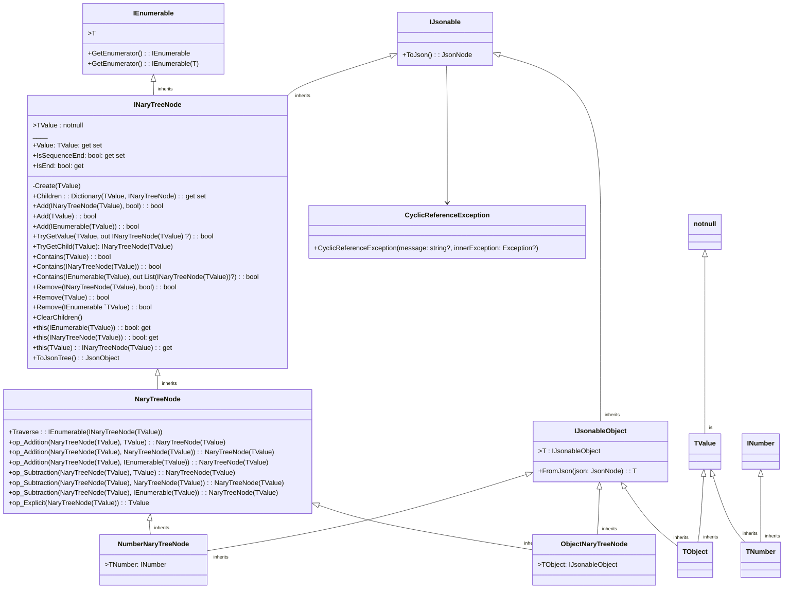

# GalacticLib

`GalacticLib`>`Objects`>`DataStructures`>**(`Trees`)**

---

```mermaid
classDiagram
    class IEnumerable {
        >T
        +GetEnumerator() : IEnumerable
        +GetEnumerator() : : IEnumerable(T)
    }
    notnull <|-- "is" TValue
    TValue <|-- "inherits" TNumber
    IJsonableObject <|-- "inherits" TObject
    TValue <|-- "inherits" TObject
    INumber <|-- "inherits" TNumber

    class CyclicReferenceException {
        +CyclicReferenceException(message: string?, innerException: Exception?)
    }
    class IJsonable {
        +ToJson(): JsonNode
    }
    class IJsonableObject {
        >T : IJsonableObject
        +FromJson(json: JsonNode): T
    }

    IJsonable <|-- "inherits" IJsonableObject
    IJsonable --> CyclicReferenceException

    IEnumerable <|-- "inherits" INaryTreeNode
    IJsonable <|-- "inherits" INaryTreeNode
    class INaryTreeNode {
        >TValue : notnull
        ____
        -Create(TValue)

        +Value: TValue: get set
        +Children : : Dictionary(TValue, INaryTreeNode): get set
        +IsSequenceEnd: bool: get set
        +IsEnd: bool: get

        +Add(INaryTreeNode(TValue), bool): bool
        +Add(TValue): bool
        +Add(IEnumerable(TValue)): bool

        +TryGetValue(TValue, out INaryTreeNode(TValue) ?): bool
        +TryGetChild(TValue): INaryTreeNode(TValue)

        +Contains(TValue): bool
        +Contains(INaryTreeNode(TValue)): bool
        +Contains(IEnumerable(TValue), out List(INaryTreeNode(TValue))?): bool

        +Remove(INaryTreeNode(TValue), bool): bool
        +Remove(TValue): bool
        +Remove(IEnumerable `TValue): bool

        +ClearChildren()

        +this(IEnumerable(TValue)) : bool: get
        +this(INaryTreeNode(TValue)) : bool: get
        +this(TValue) : : INaryTreeNode(TValue): get

        +ToJsonTree(): JsonObject
    }
    INaryTreeNode <|-- "inherits" NaryTreeNode
    class NaryTreeNode {
        +Traverse : : IEnumerable(INaryTreeNode(TValue))
        +op_Addition(NaryTreeNode(TValue), TValue) : : NaryTreeNode(TValue)
        +op_Addition(NaryTreeNode(TValue), NaryTreeNode(TValue)) : : NaryTreeNode(TValue)
        +op_Addition(NaryTreeNode(TValue), IEnumerable(TValue)) : : NaryTreeNode(TValue)
        +op_Subtraction(NaryTreeNode(TValue), TValue) : : NaryTreeNode(TValue)
        +op_Subtraction(NaryTreeNode(TValue), NaryTreeNode(TValue)) : : NaryTreeNode(TValue)
        +op_Subtraction(NaryTreeNode(TValue), IEnumerable(TValue)) : : NaryTreeNode(TValue)
        +op_Explicit(NaryTreeNode(TValue)): TValue
    }
    NaryTreeNode <|-- "inherits" NumberNaryTreeNode
    IJsonableObject <|-- "inherits" NumberNaryTreeNode
    class ObjectNaryTreeNode {
        >TObject: IJsonableObject
    }
    NaryTreeNode <|-- "inherits" ObjectNaryTreeNode
    IJsonableObject <|-- "inherits" ObjectNaryTreeNode
    class NumberNaryTreeNode {
        >TNumber: INumber
    }
```
